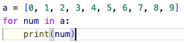

# 機械学習 第３回 python演習

# 3-1
### 以下のコードはaとbに関する四則演算を行うスクリプトである．_____を埋めよ．作成するスクリプト名は「ml0301.py」とすること．
```
a, b = 10, 20
puls = _____ # 足し算
mins = _____ # 引き算
mult = _____ # 掛け算
divi = _____ # 割り算
supr = _____ # 余り
print(plus, mins, mult, divi, supr)
```

ヒント：演算記号はC言語と同じ

実行結果：
```
$ python ./ml0301.py
30 -10 200 0.5 10
```

<details> <summary>解答</summary>
a, b = 10, 20<br>
puls = a + b # 足し算<br>
mins = a - b # 引き算<br>
mult = a * b # 掛け算<br>
divi = a / b # 割り算<br>
supr = a % b # 余り<br>
print(plus, mins, mult, divi, supr)
</details>

# 3-2
### 「文字列の足し算・引き算」，「リストの足し算・引き算」を行うと何が起きるか確認せよ．変数aには文字列abc，変数bには文字列defを代入し，変数cには数値1と数値2からなるサイズ２のリストを，変数dには数値3と数値4からなるサイズ２のリストを代入する．その後，「変数aと変数bの足し算・引き算」，「変数cと変数dの足し算・引き算」を実行する．このスクリプトはエラーを吐くはずなので，エラーとなる行を見つけ，行頭に「#」をつけコメントアウトし，エラー無しで実行できるようにせよ．作成するスクリプト名は「ml0302.py」とすること．
```
a, b = _____ # 文字列の代入
c, d = _____ # リストの代入
puls_ab = _____ # 足し算
mins_ab = _____ # 引き算
puls_cd = _____ # 足し算
mins_cd = _____ # 引き算
print(puls_ab)
print(mins_ab)
print(puls_cd)
print(mins_cd)
```

<details> <summary>解答</summary>
a, b = "abc", "def"<br>
c, d = [1, 2], [3, 4]<br>
puls_ab = a + b<br>
# mins_ab = a - b<br>
puls_cd = c + d<br>
# mins_cd = c -d<br>
print(puls_ab)<br>
# print(mins_ab)<br>
print(puls_cd)<br>
# print(mins_cd)<br>
</details>

<details> <summary>実行結果：</summary>
    $ python3 ./ml0302.py <br>
    abcdef<br>
    [1, 2, 3, 4]<br>
</details>

# 3-3
### 0~9までの数値が格納されているlistを作成しfor文を用いて以下のように表示せよ．作成するスクリプト名は「ml0303.py」とすること．

実行結果：
```
$ python3 ml0303.py
0
1
2
3
4
5
6
7
8
9
```
<details> <summary>解答</summary>

</details>

# 3-4
### 3-3の課題をlistを使わずrange()を使って実装せよ．作成するスクリプト名は「ml0304.py」とすること.
<details> <summary>ヒント(rangeの使い方)</summary>
    range(7) →　[0, 1, 2, 3, 4, 5, 6]（0 ≦ i < 7）<br>
    range(2, 7) →　[2, 3, 4, 5, 6]（2 ≦ i < 7）<br>
    range(2, 7, 2) →　[2, 4, 6]（2 ≦ i < 7 内で２飛ばし）<br>
</details>
<details> <summary>解答</summary>

</details>

## 3-4(追加)
### range()はリスト型を作成する関数では無いが，for文で用いるとリスト型のように使うことができる．以下を実行してみると確認ができる．実行はスクリプトを作成しても良いし，pythonモードで実行しても良い．一度は実行してみること．
```
R = range(5) # 0~4までを生成
print(R)    
print(type(R)) # 変数の型を調べるtype()：<class 'range'>と表示されるはず．
L = list(R) # range型をlist型にキャスト
print(L)
print(type(L)) # 変数の型を調べるtype()：<class 'list'>と表示されるはず．
```
上記の4行目のようにキャストすると明示的にrange()の返り値をlist型として使用することが可能．
<details> <summary>3-3のキャストを使った書き方</summary>

</details>

# 3-5
### for文を使用しリストの各数値と，その数値のindexを表示せよ．以下のリストを使い，作成するスクリプト名は「ml0305.py」とすること.
```
a = [98, 38, 49, 57, 30]
```


実行結果：以下の様に表示できればOK
```
$ python3 ml0305.py
0 98
1 38
2 49
3 57
4 30
```
<details> <summary>ヒント</summary>
    カウンター変数を0で初期化し，for文の中でカウター変数を1ずつ足していけば良い．<br>
    python3で変数に1を足す方法は，<br>
    i = 0 　　# カウンター変数の初期化<br>
    i += 1 (または i = i + 1) <br>
</details>

<details> <summary>解答</summary>
    
</details>

# 3-6
### 3-5をenumerate()を用いたスクリプトに書き換えよ．作成するスクリプト名は「ml0306.py」とすること.

enumerate()の使い方(＝解答)
```
a = [98, 38, 49, 57, 30]
for index, value in enumearet(a):
    print(index, value)
```
enumeate()を使用すると，list内の各値とその値のindexを取得することが可能．
よって，以下の様に記述しても同じ結果となる．
```
a = [98, 38, 49, 57, 30]
for index, _ in enumearet(a): 
    print(index, a[index])
    
# 一時的に値を代入したいときに変数として「 _ (アンダーバー)」を使う．
# 「 _ 」には何かしらが代入されるが，参照することはない．
# とりあえずの入れ物として使用する．
```

# 3-7
### 以下のような0~99が格納されたリストがある．スライスを用いて「10〜20」「50〜80を5刻み」「0〜99を33刻み」で表示せよ．作成するスクリプト名は「ml0307.py」とすること.
```
a = [
    0, 1, 2, 3, 4, 5, 6, 7, 8, 9, 10, 
    11, 12, 13, 14, 15, 16, 17, 18, 19, 20, 
    21, 22, 23, 24, 25, 26, 27, 28, 29, 30, 
    31, 32, 33, 34, 35, 36, 37, 38, 39, 40, 
    41, 42, 43, 44, 45, 46, 47, 48, 49, 50, 
    51, 52, 53, 54, 55, 56, 57, 58, 59, 60, 
    61, 62, 63, 64, 65, 66, 67, 68, 69, 70, 
    71, 72, 73, 74, 75, 76, 77, 78, 79, 80, 
    81, 82, 83, 84, 85, 86, 87, 88, 89, 90, 
    91, 92, 93, 94, 95, 96, 97, 98, 99
    ]
```

実行結果：
```
$ python3 ml0307.py
[10, 11, 12, 13, 14, 15, 16, 17, 18, 19, 20]
[50, 55, 60, 65, 70, 75, 80]
[0, 33, 66, 99]
```

<details> <summary>解答</summary>
    
</details>

# 3-8
### for文を用いて3-7のリストから値を10個ずつ取り出して表示するスクリプトを「ml0308.py」として作成せよ．
実行結果：
```
$ python3 ml0308.py
[0, 1, 2, 3, 4, 5, 6, 7, 8, 9]
[10, 11, 12, 13, 14, 15, 16, 17, 18, 19]
[20, 21, 22, 23, 24, 25, 26, 27, 28, 29]
[30, 31, 32, 33, 34, 35, 36, 37, 38, 39]
[40, 41, 42, 43, 44, 45, 46, 47, 48, 49]
[50, 51, 52, 53, 54, 55, 56, 57, 58, 59]
[60, 61, 62, 63, 64, 65, 66, 67, 68, 69]
[70, 71, 72, 73, 74, 75, 76, 77, 78, 79]
[80, 81, 82, 83, 84, 85, 86, 87, 88, 89]
[90, 91, 92, 93, 94, 95, 96, 97, 98, 99]
```
<details> <summary>ヒント</summary>
    ①range()を上手く使う．<br>
    <br>
    実行結果：<br>
    0<br>2<br>4<br>6<br>8<br><br>
    ②range()を使ってindexを作成できたら3-7の様にスライスを使う．<br>
    print(a[_____:_____])
</details>
<details> <summary>解答</summary>
    
</details>


# 3-9
### 以下の様な辞書とリストがある．辞書はkeyがindex，valueが名前の形式となっている．リストにはテストの点数が格納されており，このリストのindexと辞書のkeyは対応している．for文にてenumerate()を使用し，リストからindexと各値を取り出し，取り出したindexに対応する学生の名前を辞書から抽出し表示せよ．作成するスクリプト名は「ml0309.py」とすること.

```
names = {3:"ozawa", 0:"anbo", 1:"shimizu", 2:"masuda", 4:"iida"}
scores = [60, 80, 70, 50, 40]
# scoresのindex=0の60は"anbo"のテストの点数を，index=2の70は"masuda"のテストの点数である．
```

実行結果：以下の様に表示できればOK
```
$ python3 ml0309.py
0 anbo 60
1 shimizu 80
2 masuda 70
3 ozawa 50
4 iida 40
```

<details> <summary>ヒント</summary>
    for index, score in enumerate(scores):<br>
    とした時の，indexをkeyとするとnamesから名前を抽出可能．
    <details> <summary>大ヒント</summary>
        names[0]とすると"anbo"を参照できる．<br>
        for文の各ラウンドでindexには0〜4までが代入されるはず．
    </details>
</details>

<details> <summary>解答</summary>
    
</details>

# 3-10
### 3-9の辞書(names)とリスト(scores)を統合した，test_resultという辞書を作成し表示せよ．test_resultはkeyがindex，valueが["anbo", 60]のリストである辞書である．作成するスクリプト名は「ml0310.py」とすること.

実行結果：以下の様に表示できればOK
```
$ python3 ml03010.py
{0: ['anbo', 60], 1: ['shimizu', 80], 2: ['masuda', 70], 3: ['ozawa', 50], 4: ['iida', 40]}
```

<details> <summary>ヒント</summary>
    ①辞書の要素の追加はupdate()を使用する<br>
    update()の文法は dic.update({key:value})<br>
    valueはリストでもOK <br>
    ②update()を使用する前に空の辞書を作成する必要がある．<br>
    test_result = {} <br>
    ③3-7のfor文を用いると，for文の各ラウンドで，各学生のindex, name, scoreが獲得できるはず．それらの数値をtest_resultにupdate()すればOK
</details>

<details> <summary>解答</summary>
    
</details>

# 3-11
###  以下の様な数学の点数，英語の点数，名前が格納されている３つのリストがる．全てのリストは学籍番号順にデータが格納されている．これらのリストを統合したtest_resultというリストを作成し表示せよ．test_resultの各要素はリストとし，[名前，数学の点数，英語の点数]とすること．作成するスクリプト名は「ml0311.py」とすること.
３つのリスト
```
math = [90, 80, 50, 60]
english = [50, 60, 90, 70]
names = ["shimizu", "masuda", "iida", "ozawa"]
```

実行結果：以下の様に表示できればOK
```
$ python3 ml0311.py
[['shimizu', 90, 50], ['masuda', 80, 60], ['iida', 50, 90], ['ozawa', 60, 70]]
```
<details> <summary>ヒント</summary>
    ①リストの要素の追加はappend()を使用する<br>
    append()の文法は list.append(value)<br>
    valueがリストの場合は list.append([数値1, 数値2, 数値3]) <br>
    ②append()を使用する前に空のリストを作成する必要がある．<br>
    test_result = [] <br>
    ③3つのリストの内，どれか１つのリストに対してenumerate()を使ってfor文を実行すれば，indexが獲得出来る．そのindexを使って他の2つのリストから値を参照可能．
</details>


<details> <summary>解答１</summary>
    
</details>

<details> <summary>解答2</summary>
    zip()を使用した場合．<br>
    zip関数は<br>
    for l1, l2, l3 in zip(list1, list2, list3):<br>
    と記述した場合にlist1〜3のリストの先頭から順に値を取り出すことが可能である．<br>
    ただし，list1〜3のサイズが異なる場合，最もサイズが小さいlistの値が全て取り出されたらfor文が終了してしまう．<br>
    
</details>

# 3-12
### 2つの値を受け取り足し算した結果を返す関数，myAdd()を作成せよ．作成するスクリプト名は「ml0312.py」とし，スクリプト内に関数を記述しこのスクリプト内で参照すること．
以下参考
```
def myAdd(_____, _____):
    return _____

Sum = myAdd(任意の数値，任意の数値)
print(Sum)
```

<details> <summary>解答</summary>
    
</details>


# 3-13
### 2つの値を引数として受け取り，足し算と引き算の結果を同時に返す関数を作成せよ．作成するスクリプト名は「ml0313.py」とすること．

<details> <summary>ヒント</summary>
    
</details>

<details> <summary>解答</summary>
    
</details>


# 3-14
### 3-13で作成したスクリプトを関数のみのスクリプトと，関数を呼び出すメインのスクリプトの2つのファイルに分割せよ．関数のみのスクリプトを「ml0314_func.py」，関数を呼び出すメインのスクリプトを「ml0314.py」とせよ．

<details> <summary>ヒント</summary>
    別のスクリプト内の関数を呼び出すにはimport文を使用する．<br>
    from 参照したい関数が記述されているスクリプト名(.pyはいらない) import 関数名 <br>
    その前に，参照したい関数が記述されているスクリプトがあるディレクトリのパスをsys.path.append()でシステムに記録する必要がある．<br>
    ~/ML_class/ml03/ml0314_func.pyの時は<br>
    <br>
    import sys<br>
    sys.path.append("~/ML_class/ml03")<br>
    from ml0314_func import AddAndDiff<br>
    <br>
    とml0312.pyの最上部に記述する．
</details>

<details> <summary>解答 ml0314.py</summary>
    
</details>

<details> <summary>解答 ml0314_func.py</summary>
    
</details>

# 3-15
### 3-14では関数を別スクリプトに記述したが，この関数をクラス化する．クラスが記述されているスクリプトを「ml0315_class.py」，クラスを呼び出すメインのスクリプトを「ml0315.py」とする．両スクリプトは以下のスクリプトの「 ____ 」を穴埋めすれば良い．

ml0315.py


ml0315_class.py


実行結果：
```
$ python3 ml0315.py
35 5
```

<details> <summary>解答 ml0315.py</summary>
    
</details>

<details> <summary>解答 ml0315_class.py</summary>
    
</details>


# 3-16
### 2つの2次元の行列の足し算を行うスクリプトを「ml0316.py」として作成せよ．

2次元の行列は以下の２つのリストを使用すること．
```
Mat1 = [
    [1, 2, 3],
    [4, 5, 6],
    [7, 8, 9]
]

Mat2 = [
    [1, 4, 7],
    [2, 5, 8],
    [3, 6, 9]
]
```
実行結果：
```
$ python3 ml0316.py
[2, 6, 10]
[6, 10, 14]
[10, 14, 18]
```
<details> <summary>ヒント</summary>
    ① Mat1とMat2と同じサイズのリスト，resultを用意し，全ての要素を0で初期化しておく．<br>
    ② 2重のfor文を使って，Mat1とMat2の対応する要素を足し，resultの対応する場所に格納されている0に足す．<br>
    例) result[_____][_____] += Mat1[_____][_____] + Mat2[_____][_____]
</details>

<details> <summary>解答</summary>
    
</details>


# 3-17
### 2つの2次元の行列の足し算を行うクラス，AddMatricesクラスを作成せよ．AddMatricesを記述するスクリプトは「MyAddMatrices.py」とし，AddMatricesを呼び出すメインのスクリプトは「ml0317.py」とせよ．AddMatricesは以下の条件を満たすこと．

AddMatricesクラスの条件
```
① AddMatricesクラスは「__init__」と「calculate」の2つの関数を持つ．
② メインのスクリプト(ml0317.py)でAddMatricesクラスを生成する時に,２つの行列を引数として渡すこと．言い換えると 「__init__」は２つの行列を引数として受け取る．
③ 「calculate」は引数を受け取らずに計算を行い，結果をメインのスクリプトにreturnする．
```

<details> <summary>ヒント1</summary>
    ① 「__init__」で引数として受け取った変数を，他の関数(calculate)で使用したい場合は，「__init__」内で受け取った変数の値を，変数名が「self.」で始まる変数に代入する．<br>
    ② クラス内の全関数はselfを引数として持つ(第3回講義資料，p41参照)．<br>
    ③
</details>

<details> <summary>ヒント2(MyAddMatrices.py，穴埋め)</summary>
   
</details>

<details> <summary>ヒント3(ml0317.py，穴埋め)</summary>
   
</details>

<details> <summary>解答(MyAddMatrices.py)</summary>
    
</details>

<details> <summary>解答(ml0317.py)</summary>
    
</details>

# 3-18
### 3-17を参考に２つの２次元の行列の引き算を行うクラス，SubMatricesクラスを作成せよ．作成するスクリプトは「MySubMatrices.py」と「ml0318.py」とせよ．

<details> <summary>解答(MySubMatrices.py)</summary>
    
</details>

<details> <summary>解答(ml0318.py)</summary>
    
</details>


# 3-19
### 3-17を参考に２つの２次元の行列の掛け算を行うクラス，MulMatricesクラスを作成せよ．作成するスクリプトは「MyMulMatrices.py」と「ml0319.py」とせよ．

以下の行列を使用した場合，
```
Mat1 = [
    [1, 2, 3],
    [4, 5, 6],
    [7, 8, 9]
]

Mat2 = [
    [1, 4, 7],
    [2, 5, 8],
    [3, 6, 9]
]
```
実行結果：
```
$ python3 ml0319.py
[14, 32, 50]
[32, 77, 122]
[50, 122, 194]
```
となる．

<details> <summary>解答(MyMulMatrices.py)</summary>
    
</details>

<details> <summary>解答(ml0319.py)</summary>
    
</details>


# 3-20
### 以下のスクリプト「ml0320.py」を作成し，AddMatrices，SubMatrices，MulMatricesの3つのクラスをリストに格納し，for文を用いて順番に各クラスのメソッドが計算できることを確認せよ．


各行の説明：
```
3~5行目：３つのクラスをimport．
10行目：importしたクラスをMyClassesというリストに格納．このようにクラスも変数であるのでリストや辞書に格納することが可能．
12行目：MyClassesから各クラスを取り出し，Classに代入している．
13行目：各クラスの生成．3-19の「matrix = MulMatrices(Mat1, Mat2)」に対応している．
14行目：各クラスの「calculate」関数を実行している．この様に，異なるクラスで同じ名前の関数を作成することで，for文などで実行しやすくなる．3-19の「result = matrix.calculate()」に対応．

```

実行結果：
```
$ python3 ml0320.py
[2, 6, 10]
[6, 10, 14]
[10, 14, 18]

[0, -2, -4]
[2, 0, -2]
[4, 2, 0]

[14, 32, 50]
[32, 77, 122]
[50, 122, 194]
```

# 課題
### 3-20の15~16行目を書き換えて，各クラスが計算した結果を"要素9の1次元のリスト"と"9✖️1のリスト"に変換して表示するスクリプト「ml03_kadai.py」を作成せよ．

各クラスに引数で渡す行列は以下の２つを使用すること．
```
Mat1 = [
    [1, 2, 3],
    [4, 5, 6],
    [7, 8, 9]
]

Mat2 = [
    [1, 4, 7],
    [2, 5, 8],
    [3, 6, 9]
]
```

実行結果：
```
$ python3 ml03_kadai.py
1次元: [2, 6, 10, 6, 10, 14, 10, 14, 18]
9✖️1: [[2], [6], [10], [6], [10], [14], [10], [14], [18]]

1次元: [0, -2, -4, 2, 0, -2, 4, 2, 0]
9✖️1: [[0], [-2], [-4], [2], [0], [-2], [4], [2], [0]]

1次元: [14, 32, 50, 32, 77, 122, 50, 122, 194]
9✖️1: [[14], [32], [50], [32], [77], [122], [50], [122], [194]]
```

