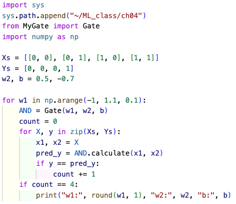

# 機械学習 第4回 python演習 (パーセプトロンで論理回路を表現する)

# 4-P1
### 以下の「_____」を適切に埋めて,「MyGate.py」を作成せよ．難しく見えるかもしれないが，4-9で作成したMyAddMatrices.pyやMyMulMatrices.pyと構造はほぼ変わらない．

```python
import numpy as np

class Gate:
    def __init__(self, w1, w2, b):
        self.w = _____ # w1とw2を要素に持つ1次元のndarrayを作成
        ____.b = b # bをどこからでも参照可能にする

    def calculate(self, x1, x2):
        x = _____ # x1とx2を要素に持つ1次元のndarrayを作成
        mul = ____ # xとself.wのアダマール積
        aff = np.sum(mul) + self.b # np.sum(mul)→mul内の全要素の総和
        if aff <= 0:
            return ____ # affineの結果が0以下の時
        else:
            return ____ # affineの結果が1より大きい時
```
### ヒント
### ①__init__(self, w1, w2, b)のw1, w2, bはfloat型の変数である．
### ②np.sum(mul)とすると1次元ndarrayであるmul内の全ての要素を足した合わせることができる．
### ③np.sum(mul) + self.bでは，np.sum(mul)の結果はnp.int64型であるが，通常のint型とみなしてOK．よってこの計算は "int型 + float型" である．

<details> <summary>解答</summary>
    
</details>

# 4-P2
### ANDゲートのx1とx2の値とyの値を格納した以下のXsとYsというリストをfor文を1個だけ用いて出力するスクリプトを「ml04P02.py」として作成せよ．

```python
Xs = [[0, 0], [0, 1], [1, 0], [1, 1]]
Ys = [0, 0, 0, 1]
```

実行結果：
```bash
$ python3 ./ml04P02.py
0 0 0
0 1 0
1 0 0
1 1 1
```
<details> <summary>ヒント</summary>
    ①zip()を使うとXsとYsから同時に要素を1個ずつ取り出すことができる．<br>
    <b>for X, Y in zip(Xs, Ys):</b><br><br>
    ②上記for文の変数であるXはサイズ2のリストである．リストからの値の取り出したは，<br>
    <b>A = [0, 0]<br>a1, a2 = A</b><br>
    とすると一気に2つの値を取り出すことが可能である．<br>
</details>

<details> <summary>解答</summary>
    
</details>

# 4-P3
### ANDゲートのパラメータw1, w2, bを以下の値として，MyGate.pyからGateクラスを呼び出し，ANDゲートを表現する(計算する)スクリプトを「ml04P03.py」として作成せよ．Gateクラスが計算した結果がYsの各値と一致することをif文で判定し表示すること．「_____」を埋めれば良い．

```python
w1, w2, b = 0.5, 0.5, -0.7
```

実行結果：
```bash
$ python3 ./ml04P3.py
0 0 0 pred_y: 0
0 1 0 pred_y: 0
1 0 0 pred_y: 0
1 1 1 pred_y: 1
```

<b>ml04P03.py</b>
```python
import sys
sys.path.append("~/ML_class/ch04")
from MyGate import _____
import numpy as np

Xs = [[0, 0], [0, 1], [1, 0], [1, 1]]
Ys = [0, 0, 0, 1]

w1, w2, b = 0.5, 0.5, -0.7

AND = Gate(_____, _____, _____)
for X, y in zip(Xs, Ys):
    x1, x2 = X
    pred_y = AND._____(x1, x2)
    if y == _____:
        print(x1, x2, y, "pred_y:", pred_y)
```

<details> <summary>解答</summary>
    
</details>

# 4-P4
### ANDゲートのパラメータw1を-1〜1の間を0.1刻みで探索するスクリプトを「ml04P04.py」として作成せよ．w2, bは4-P3の値を使って良い．

```python
① -1〜1の間で0.1刻みの数値の生成は
    np.arange()
　　を使う．
② w1, w2, bをパラメータとして生成したGateクラスで計算した値と，Ysの各値が全て一致した時，w1, w2, bはANDゲートを表現するパラメータを言える．それを実装する方法は複数あるが，例えば「カウンター変数を用意し一致したらカウンター変数を+1する」など．
③ np.float32型の表示は桁数が多く，煩雑なのでround()を使って四捨五入し表示する．
a = 0.699999999999の時
round(a, 1)とすると
→ 0.7となる．
round(変数, N)
→ 変数を少数第N桁で四捨五入する．
```

実行結果：
```bash
$ python ml04P04.py
w1: 0.3 w2: 0.5 b: -0.7
w1: 0.4 w2: 0.5 b: -0.7
w1: 0.5 w2: 0.5 b: -0.7
w1: 0.6 w2: 0.5 b: -0.7
w1: 0.7 w2: 0.5 b: -0.7
```

<details> <summary>ヒント</summary>
    以下の「_____」を埋めれば良い．<br>
    
</details>

<details> <summary>解答</summary>
    
</details>

# 4-P5
### w1と同様にw2, bについても-1〜1の間を0.1刻みで探索するスクリプトを「ml04P05.py」として作成せよ．

実行結果：
```bash
$ python ml04P05.py
w1: 0.1 w2: 0.1 b: -0.1
w1: 0.1 w2: 0.2 b: -0.2
w1: 0.1 w2: 0.3 b: -0.3
w1: 0.1 w2: 0.4 b: -0.4
w1: 0.1 w2: 0.5 b: -0.5
〜〜〜　途中省略　〜〜〜
w1: 1.0 w2: 0.6 b: -1.0
w1: 1.0 w2: 0.7 b: -1.0
w1: 1.0 w2: 0.8 b: -1.0
w1: 1.0 w2: 0.9 b: -1.0
w1: 1.0 w2: 1.0 b: -1.0
```

<details> <summary>解答</summary>
    
</details>

# 4-P6
### 4-P5と同様にORゲートのw1, w2, bを探索するスクリプトを「ml04P06.py」として作成せよ．

実行結果：
```bash
$ python ml04P06.py
w1: 0.1 w2: 0.1 b: -0.0
w1: 0.1 w2: 0.2 b: -0.0
w1: 0.1 w2: 0.3 b: -0.0
w1: 0.1 w2: 0.4 b: -0.0
w1: 0.1 w2: 0.5 b: -0.0
〜〜〜　途中省略　〜〜〜
w1: 1.0 w2: 1.0 b: -0.4
w1: 1.0 w2: 1.0 b: -0.3
w1: 1.0 w2: 1.0 b: -0.2
w1: 1.0 w2: 1.0 b: -0.1
w1: 1.0 w2: 1.0 b: -0.0
```

<details> <summary>ヒント</summary>
    4-P5の<br>
    <b>Ys = [ _____, _____, _____, _____ ]</b><br>
    をORゲートのものにすればOK
</details>

<details> <summary>解答</summary>
    
</details>

# 4-P7
### 4-P5と同様にNANDゲートのw1, w2, bを探索するスクリプトを「ml04P07.py」として作成せよ．

実行結果：
```bash
$ python ml04P07.py
w1: -0.9 w2: -0.9 b: 1.0
w1: -0.9 w2: -0.8 b: 1.0
w1: -0.9 w2: -0.7 b: 1.0
w1: -0.9 w2: -0.6 b: 1.0
w1: -0.9 w2: -0.5 b: 1.0
〜〜〜　途中省略　〜〜〜
w1: -0.1 w2: -0.5 b: 0.6
w1: -0.1 w2: -0.4 b: 0.5
w1: -0.1 w2: -0.3 b: 0.4
w1: -0.1 w2: -0.2 b: 0.3
w1: -0.1 w2: -0.1 b: 0.2
```

<details> <summary>解答</summary>
    
</details>


# 課題
### 4-P5, 4-P6, 4-P7で探索したAND, NAND, OR を表現する w1, w2, b の値を適当に選択せよ．それらのパラメータを使用したAND, NAND, OR を使って XORゲートを計算せよ．スクリプト名は「XOR.py」とすること．

実行結果：
```bash
$ python3 XOR.py
0 0 0 pred_y: 0
0 1 1 pred_y: 1
1 0 1 pred_y: 1
1 1 0 pred_y: 0
```

<details> <summary>ヒント</summary>
    ①<b>AND = Gate( _____, _____, _____ )</b><br>
    「 _____ 」は4-P5の候補から適当に選ぶ．ORとNANDについても同様<br><br>
    ②<b> Ys = [ _____, _____, _____, _____ ]</b><br>
    XORゲートのYの値を入れる<br><br>
    ③<b>ml04P03.py</b>と同様に<b>pred_y</b>と<b>y</b>が一致する時表示するようにする．
</details>