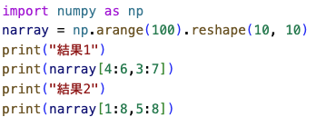

# 機械学習 第4回 python演習 (Numpy & Matolitlib)

# 4-1
### 以下の３つのndarrayを作成し表示する，スクリプト「ml0401.py」を作成せよ．

実行結果：
```
$ python3 ml0401.py
[1 2 3 4]

[[1 2]
 [3 4]]

[[1. 2.]
 [3. 4.]]
```

<details> <summary>ヒント</summary>
① numpyをimportする<br>
<b>import numpy as np</b><br><br>
② ndarrayを作成する<br>
<b>n_array = np.array([1, 2, 3, 4])</b><br><br>
③ ndarrayの各要素の型を指定する<br>
<b>n_array = np.array([1, 2, 3, 4], np.float32)</b><br><br>
</details>

<details> <summary>解答</summary>
    
</details>

# 4-2
### 以下のような0~11を保持する1次元のndarrayをarange()を用いて作成し表示する．その後，作成した1次元のndarrayを"2×6"と"4×3"のndarrayに形状を変換し表示するスクリプトを「ml0402.py」として作成せよ．

```
[0 1 2 3 4 5 6 7 8 9 10 11]
```

実行結果：
```
[[ 0  1  2  3  4  5]
 [ 6  7  8  9 10 11]]

[[ 0  1  2]
 [ 3  4  5]
 [ 6  7  8]
 [ 9 10 11]]
```

<details> <summary>ヒント</summary>
① arange()はrange()と同じ様に使用可能<br>
ragne()の使い方は先週の資料参照()<br>
② ndarrayの形状の変更は<br>
<b>reshape()</b><br>
を使用する．<br>
</details>

<details> <summary>解答</summary>
    
</details>

# 4-3 
### 以下のような0~99を保持する2次元のndarrayを作成し，スライスを用いて実行結果の様に表示するスクリプトを「ml0403.py」として作成せよ．

<b>ndarray</b>
```
[[ 0  1  2  3  4  5  6  7  8  9]
 [10 11 12 13 14 15 16 17 18 19]
 [20 21 22 23 24 25 26 27 28 29]
 [30 31 32 33 34 35 36 37 38 39]
 [40 41 42 43 44 45 46 47 48 49]
 [50 51 52 53 54 55 56 57 58 59]
 [60 61 62 63 64 65 66 67 68 69]
 [70 71 72 73 74 75 76 77 78 79]
 [80 81 82 83 84 85 86 87 88 89]
 [90 91 92 93 94 95 96 97 98 99]]
```

実行結果：
```
$ python3 ml0403.py
結果1
[[43 44 45 46]
 [53 54 55 56]]
結果2
[[15 16 17]
 [25 26 27]
 [35 36 37]
 [45 46 47]
 [55 56 57]
 [65 66 67]
 [75 76 77]]
```

<b>スライスについては講義資料を参照</b>

<details> <summary>解答</summary>
    
</details>

# 4-4
### 4-3の2次元のndarrayから6で割り切れる要素を抜き出し，リストに格納し，対象の要素を全て抽出後表示するスクリプトを「ml0404.py」として作成せよ．for文を必ず使うこと．

実行結果：
```
[0, 6, 12, 18, 24, 30, 36, 42, 48, 54, 60, 66, 72, 78, 84, 90, 96]
```
<details> <summary>ヒント</summary>
    ① for文を用いてndarrayから要素を１つずつ抽出し，6で割り切れるかif文を用いて判定すれば良い．<br>
    ② 抽出した値はappend()でリストに追加する．<br>
</details>

<details> <summary>解答</summary>
    
</details>

# 4-5
### 4-4の課題をfor文を使わないで実装せよ．スクリプト名は 「ml0405.py」とせよ．

実行結果：
```
[ 0  6 12 18 24 30 36 42 48 54 60 66 72 78 84 90 96]
```

<details> <summary>ヒント</summary>
    ① 第４回講義資料のスライド25-26を参照．<br>
    <b>
        n_array = np.array([1, -2, 3, -4])<br>
        print(n_array[n_array>0])<br>
    </b>
    ↓<br>
    ↓<br>
    <b>出力：[1 3]<br></b>
</details>

<details> <summary>解答</summary>
    
</details>


# 4-6
### 以下のndarrayのna1とna2の四則演算の結果を表示するスクリプトを「ml0406.py」として作成せよ．
```
na1
[[3 5]
 [9 4]]

na2
[[4 3]
 [7 1]]
```

実行結果：
```
$ python3 ml0406.py
足し算：
[[ 7  8]
 [16  5]]
引き算：
[[-1  2]
 [ 2  3]]
掛け算(アダマール積)：
[[12 15]
 [63  4]]
割り算：
[[0.75       1.66666667]
 [1.28571429 4.        ]]
```
<details> <summary>解答</summary>
    
</details>

# 4-7
### 以下の2つのndarrayの行列積を求めるスクリプト「ml0407.py」を作成せよ．
```
na1
[[-6 5]
 [-3 4]]

na2
[[4 -4]
 [1 1]]
```

実行結果：
```
$ python3 ml0407.py
[[-19  29]
 [ -8  16]]
```

<details> <summary>ヒント</summary>
    行列積の計算は<br>
    <b>np.dot()</b><br>
    を使用する．
</details>

<details> <summary>解答</summary>
    
</details>

# 4-8
### 以下の4つのndarrayについて次の行列積を((na1×na2)×na3)×na4の順で計算するスクリプト「ml0408.py」を作成せよ．この順序で掛け合わせるのエラーとなるので，適宜「転置」を用いることで計算すること．
```
na1:
[[-2  5]
 [-3  4]]
na2:
[[ 4 -4  1]
 [ 1 -1  3]]
na3:
[[-6  5  4]
 [-4 -7  1]
 [-1 -2  4]
 [ 1  2  3]]
na4:
[[ 2 -2  1 -1]
 [ 1  1 -1  2]]
```

実行結果：
```
$ python3 ml0408.py
[[169 124]
 [271 151]]
```

<details> <summary>ヒント</summary>
    ①行列の転置は<br>
    <b>ndarray.T</b><br>
    を使用する．<br>
    ②<b>ndarray.shape</b>を使用すると行列の形状の確認をすることができる．<br>
</details>

<details> <summary>解答</summary>
    
</details>

# 4-10
### 先週の演習